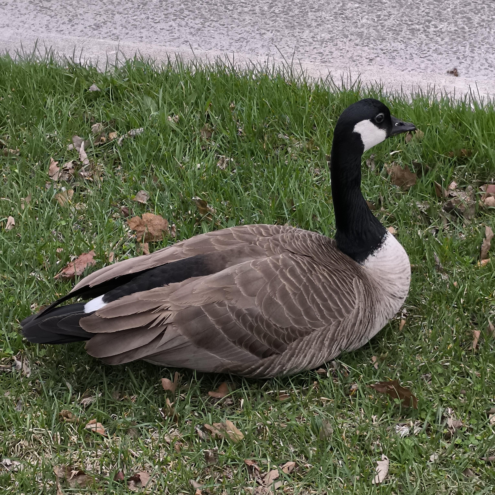

<p align="center">
    
</p>

-------------------------------------------------------------------------------------------------------------

<span style="font-weight:normal">**GOOSE**: **G**raphs **O**ptimised f**O**r **S**earch **E**valuation</span>
=============================================================================================================

GOOSE is a learning for planning framework. It contains various methods for learning representations for planning tasks, and algorithms for using such representations for solving planning tasks. Currently, GOOSE supports [ground STRIPS](https://github.com/aibasel/downward), [lifted STRIPS](https://github.com/abcorrea/powerlifted), and [ground numeric (non-temporal PDDL2.1) planning](https://github.com/Kurorororo/numeric-fast-downward).

If you just want to use the WL features introduced in our [ICAPS'24 paper](https://arxiv.org/abs/2403.16508), take a look at the [WLPlan](https://github.com/DillonZChen/wlplan) package.

Note that the main branch contains **no GNN implementations**. Please refer to the `icaps24` branch or release for *domain-dependent* GNNs, and `aaai24` for *domain-independent* GNNs.

See [references](#references) for the corresponding publications.


## tl;dr for downloading and running GOOSE on existing benchmarks
GOOSE can be installed and run with pretrained weights for the IPC23LT benchmarks in a matter of lines.

```
# (1) Download the Apptainer image
apptainer pull goose.sif oras://ghcr.io/dillonzchen/goose:latest

# (2) Install benchmarks
git submodule update --init --recursive benchmarks

# (3) Plan with pretrained weights
./goose.sif plan benchmarks/ipc23lt/blocksworld/domain.pddl benchmarks/ipc23lt/blocksworld/testing/p1_30.pddl pretrained_models/ipc23lt-blocksworld.model
```

See further below for more information on how to train and plan with GOOSE for different settings.


## Table of contents
- [**GOOSE**: **G**raphs **O**ptimised f**O**r **S**earch **E**valuation](#goose-graphs-optimised-for-search-evaluation)
  - [tl;dr for downloading and running GOOSE on existing benchmarks](#tldr-for-downloading-and-running-goose-on-existing-benchmarks)
  - [Table of contents](#table-of-contents)
  - [Setup](#setup)
    - [Download Apptainer image](#download-apptainer-image)
    - [Build Apptainer image](#build-apptainer-image)
    - [Manual compilation](#manual-compilation)
  - [Usage](#usage)
    - [Training](#training)
    - [Planning](#planning)
    - [Recommended configurations](#recommended-configurations)
  - [References](#references)


## Setup

There are 3 possible ways to install GOOSE. First, install submodules

```
git submodule update --init --recursive
```


### Download Apptainer image
Download the image from the internet

    apptainer pull goose.sif oras://ghcr.io/dillonzchen/goose:latest


### Build Apptainer image
Install [Apptainer](https://apptainer.org/) and then build the image

    sudo apt-get install apptainer
    sudo apptainer build goose.sif Apptainer


### Manual compilation
You will need the usual cpp packages

    sudo apt-get install build-essential g++ cmake libboost-all-dev

**[Optional]** For numeric planning, you will also need Python2 as we use Numeric Fast Downward which requires it. To install from source (e.g. for Ubuntu 23.04 and above) and symlink to `python2`:

    wget https://www.python.org/ftp/python/2.7.9/Python-2.7.9.tgz
    sudo tar xzf Python-2.7.9.tgz
    cd Python-2.7.9
    sudo ./configure --enable-optimizations
    sudo make altinstall
    sudo ln -s /usr/local/bin/python2.7 /usr/local/bin/python2

Create a virtual environment, activate it, install packages, and build cpp components.
The setup has been tested with python versions 3.10 and higher, but should probably work for different python3 versions as well.

    python3 -m venv venv
    source venv/bin/activate
    pip install -r requirements.txt
    sh build.sh

In case a virtual environment does not work, you can also try anaconda and specify a Python version:

    conda create --name goose python=3.10.4
    conda activate goose
    pip install -r requirements.txt
    sh build.sh


## Usage


### Training
Call `goose.sif train -h` or `python3 train.py -h` for arguments, you will need the `-s` argument if you want to save the model.
- See below for [recommended training configurations](#recommended-configurations).
- To add your own datasets, follow the directory and `.toml` file structure.
- If you own a CPLEX license and want to train LP models faster, [add it to PYTHONPATH](https://www.ibm.com/docs/en/icos/22.1.1?topic=cplex-setting-up-python-api) and use the manual installation.

e.g.

    ./goose.sif train configurations/data/neurips24/childsnack.toml configurations/model/numeric.toml -s numeric_childsnack.model


### Planning
Call `goose.sif plan -h` or `python3 plan.py -h` for arguments.
e.g.

    ./goose.sif plan benchmarks/neurips24/childsnack/domain.pddl benchmarks/neurips24/childsnack/testing/p2_30.pddl numeric_childsnack.model


### Recommended configurations
For classical planning, train with the `configurations/model/classic.toml` configuration file.
e.g. with Blocksworld

    # Training
    ./goose.sif train configurations/data/ipc23lt/blocksworld.toml configurations/model/classic.toml -s blocksworld.model

    # Planning                 
    ./goose.sif plan benchmarks/ipc23lt/blocksworld/domain.pddl benchmarks/ipc23lt/blocksworld/testing/p1_01.pddl blocksworld.model

For numeric planning, train with the `configurations/model/numeric.toml` configuration file.
e.g. with numeric Childsnack

    # Training
    ./goose.sif train configurations/data/neurips24/childsnack.toml configurations/model/numeric.toml -s numeric_childsnack.model

    # Planning  
    ./goose.sif plan benchmarks/neurips24/childsnack/domain.pddl benchmarks/neurips24/childsnack/testing/p2_30.pddl numeric_childsnack.model


## References
GOOSE has been published in various venues. Please refer to the [releases](https://github.com/DillonZChen/goose/releases) page to find the latest version to use or code from a specific publication. The relevant publications so far for this repository are listed as follows.

- Dillon Ze Chen and Sylvie Thiébaux. **Graph Learning for Numeric Planning**. NeurIPS 2024.

```
@inproceedings{chen.thiebaux.neurips2024,
    author       = {Dillon Z. Chen and
                    Sylvie Thi{\'{e}}baux},
    title        = {Graph Learning for Numeric Planning},
    booktitle    = {NeurIPS},
    year         = {2024}
}
```

- Dillon Ze Chen and Felipe Trevizan and Sylvie Thiébaux. **Return to Tradition: Learning Reliable Heuristics with Classical Machine Learning**. ICAPS 2024.

```
@inproceedings{chen.etal.icaps2024,
    author       = {Dillon Z. Chen and
                    Felipe W. Trevizan and
                    Sylvie Thi{\'{e}}baux},
    title        = {Return to Tradition: Learning Reliable Heuristics with Classical Machine
                    Learning},
    booktitle    = {{ICAPS}},
    pages        = {68--76},
    publisher    = {{AAAI} Press},
    year         = {2024}
}
```

- Dillon Ze Chen and Sylvie Thiébaux and Felipe Trevizan. **Learning Domain-Independent Heuristics for Grounded and Lifted Planning**. AAAI 2024.

```
@inproceedings{chen.etal.aaai2024,
    author       = {Dillon Ze Chen and
                    Sylvie Thi{\'{e}}baux and
                    Felipe W. Trevizan},
    title        = {Learning Domain-Independent Heuristics for Grounded and Lifted Planning},
    booktitle    = {{AAAI}},
    pages        = {20078--20086},
    publisher    = {{AAAI} Press},
    year         = {2024}
}
```
