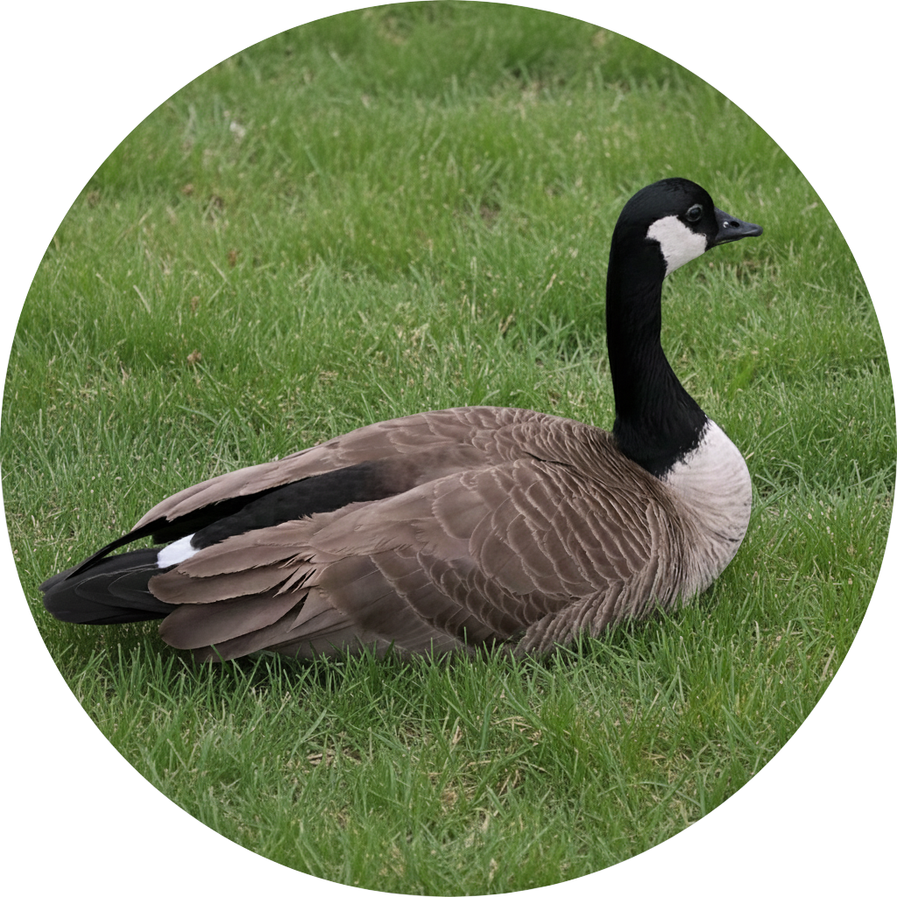

<p align="center">
    
</p>

-------------------------------------------------------------------------------------------------------------

<span style="font-weight:normal">**GOOSE**: **G**raphs **O**ptimised f**O**r **S**earch **E**valuation</span>
=============================================================================================================

GOOSE is a PDDL planning system that leverages graph learning. A description of the GOOSE framework is available at [https://dillonzchen.github.io/goose]([dillonzchen.github.io/goose](https://dillonzchen.github.io/goose)).

The main branch and recent releases currently do not support **Graph Neural Networks** (GNNs). This is because we showed in our [ICAPS-24 paper](https://arxiv.org/abs/2403.16508) that GNNs are inefficient and not effective for learning value functions for heuristic search. Nevertheless, GNNs can still be accessed from the following branches and the corresponding planning modes they support.
- `icaps24`: lifted planning
- `aaai24`: domain-independent, ground and lifted planning
- `neurips24`: numeric planning

Instead, GOOSE uses **Weisfeiler-Leman Features** (WLFs) to construct embeddings of planning tasks for machine learning pipelines. The underlying code for doing so is located in the [WLPlan](https://github.com/DillonZChen/wlplan) library.


## Quick Start on Existing Benchmarks
GOOSE can be installed and run with pretrained weights for the [IPC23LT](https://github.com/ipc2023-learning/benchmarks) benchmarks in a matter of lines after cloning this repository.

```
# (1) Download the Apptainer image
apptainer pull goose.sif oras://ghcr.io/dillonzchen/goose:latest

# (2) Install benchmarks
git submodule update --init --recursive benchmarks

# (3) Plan with pretrained weights
./goose.sif plan benchmarks/ipc23lt/blocksworld/domain.pddl benchmarks/ipc23lt/blocksworld/testing/p0_30.pddl pretrained_models/ipc23lt-blocksworld.model
```

In step 3, `blocksworld` can be replaced with any other IPC23LT domain.
See further below for more information on how to train and plan with GOOSE for different settings.


## Table of contents
- [**GOOSE**: **G**raphs **O**ptimised f**O**r **S**earch **E**valuation](#goose-graphs-optimised-for-search-evaluation)
  - [Quick Start on Existing Benchmarks](#quick-start-on-existing-benchmarks)
  - [Table of contents](#table-of-contents)
  - [Setup](#setup)
    - [(1) Download Apptainer image](#1-download-apptainer-image)
    - [(2) Build Apptainer image](#2-build-apptainer-image)
    - [(3) Manual compilation](#3-manual-compilation)
  - [Usage](#usage)
    - [Training](#training)
    - [Planning](#planning)
    - [Recommended configurations](#recommended-configurations)
  - [Abbreviations](#abbreviations)


## Setup

First, install submodules

```
git submodule update --init --recursive
```

Then there are 3 possible ways to install GOOSE.

### (1) Download Apptainer image
Download the image from the internet

    apptainer pull goose.sif oras://ghcr.io/dillonzchen/goose:latest


### (2) Build Apptainer image
Install [Apptainer](https://apptainer.org/) and then build the image

    sudo apt-get install apptainer
    python3 apptainer/build.py


### (3) Manual compilation
You will first need the usual cpp packages

    sudo apt-get install build-essential g++ cmake libboost-all-dev

**[Optional]** For numeric planning, you will also need Python2 as we use Numeric Fast Downward which requires it. To install from source (e.g. for Ubuntu 23.04 and above) and symlink to `python2`:

    wget https://www.python.org/ftp/python/2.7.9/Python-2.7.9.tgz
    sudo tar xzf Python-2.7.9.tgz
    cd Python-2.7.9
    sudo ./configure --enable-optimizations
    sudo make altinstall
    sudo ln -s /usr/local/bin/python2.7 /usr/local/bin/python2

Then create a virtual environment, activate it, install packages, and build cpp components.
The setup has been tested with python versions 3.10 and higher.

    python3 -m venv venv
    source venv/bin/activate
    pip install -r requirements.txt
    ./build

In case a virtual environment does not work, you can also try anaconda and specify a Python version:

    conda create --name goose python=3.10.4
    conda activate goose
    pip install -r requirements.txt
    ./build


## Usage
### Training
Call `goose.sif train -h` or `python3 train.py -h` for more detailed instructions. You will need the `-s` argument if you want to save the model.
- See below for [recommended training configurations](#recommended-configurations).
- To add your own datasets, follow the directory and file structure specified in `python3 train.py -h`.
- If you own a CPLEX license and want to train LP models faster, [add it to PYTHONPATH](https://www.ibm.com/docs/en/icos/22.1.1?topic=cplex-setting-up-python-api) and use the manual installation.

e.g.

    ./train.py benchmarks/neurips24/childsnack configurations/numeric.toml -s numeric_childsnack.model


### Planning
Call `goose.sif plan -h` or `python3 plan.py -h` for more detailed instructions.

e.g.

    ./plan.py benchmarks/neurips24/childsnack/domain.pddl benchmarks/neurips24/childsnack/testing/p2_30.pddl numeric_childsnack.model


### Recommended configurations
For **classical** planning, train with the `configurations/classic.toml` configuration file.
e.g. with Blocksworld

    # Training
    ./train.py benchmarks/ipc23lt/blocksworld configurations/classic.toml -s blocksworld.model

    # Planning
    ./plan.py benchmarks/ipc23lt/blocksworld/domain.pddl benchmarks/ipc23lt/blocksworld/testing/p1_01.pddl blocksworld.model

For **numeric** planning, train with the `configurations/numeric.toml` configuration file.
e.g. with numeric Childsnack

    # Training
    ./train.py benchmarks/neurips24/childsnack configurations/numeric.toml -s numeric_childsnack.model

    # Planning
    ./plan.py benchmarks/neurips24/childsnack/domain.pddl benchmarks/neurips24/childsnack/testing/p2_30.pddl numeric_childsnack.model


## Abbreviations
- GNN: Graph Neural Network
- GOOSE: **G**raphs **O**ptimised f**O**r **S**earch **E**valuation
- ICAPS: International Conference on Automated Planning and Scheduling
- IPC23LT: International Planning Competition 2023 Learning Track
- PDDL: Planning Domain Definition Language
- WLF: Weisfeiler-Leman Feature
